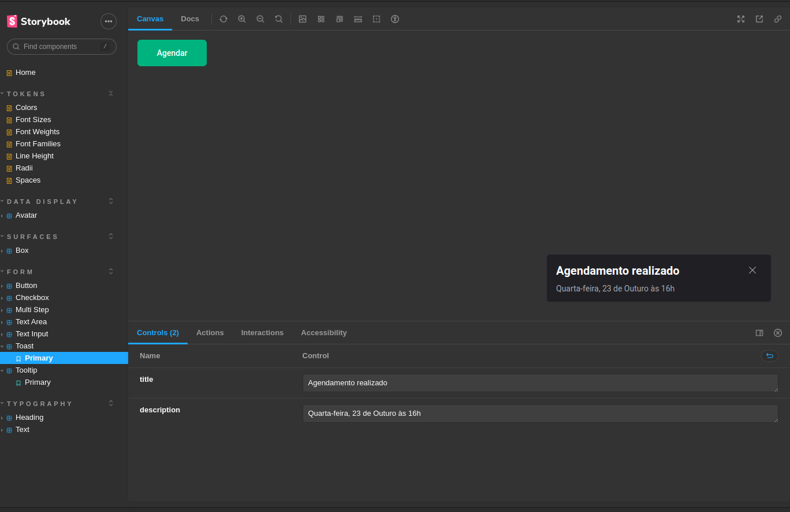

## Desafio 05 - Design System

 
 
### Nesse desafio, foram adicionados mais dois componentes (Toast e Tooltip) ao design system desenvolvido durante o modulo #5
 
 

 

 
 

### 🛠️ No projeto foi utilizado

* TypeScript
* Stitches
* Storybook
* Radix

